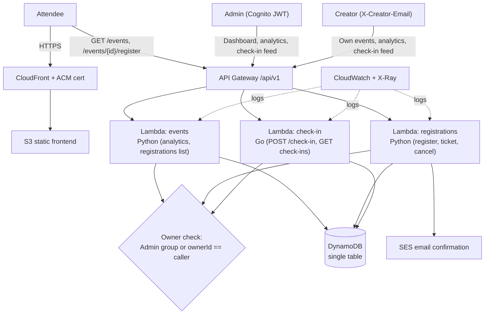

# Kaluna

A serverless event registration and ticketing platform on AWS — built to replace Microsoft Forms + Excel with a real API, QR-based check-in, and a dashboard with live capacity and attendance tracking.

Built as an Azubi Africa capstone, engineered like a small production system rather than a coursework assignment.

## Status

| Area | Built |
|---|---|
| Check-in `POST /api/v1/check-in` (200 → 409 flow) | ✅ |
| RBAC: Creator blocked from other owners' registrations/check-ins | ✅ |
| RBAC: Creator analytics scoped to own events | ✅ |
| RBAC: Admin (Godmode) access preserved | ✅ |
| Password-less creator flow (identify by email, no login) | ✅ |
| Demo-data removed from frontend (no fabricated events/tickets) | ✅ |
| Frontend hosted on S3 + CloudFront | ✅ |
| Custom domain (CloudFront + ACM cert) | ✅ |
| 404 → SPA (S3/CloudFront error pages) | ✅ |
| Terraform CI on push (`.github/workflows/deploy.yml`) | ✅ |
| Frontend CD — S3 sync + CloudFront cache invalidation | ✅ |

## Stack

- **Architecture**: API Gateway → Lambda → DynamoDB, static frontend on S3/CloudFront
- **Compute**: AWS Lambda — Python (events, registrations), Go (check-in)
- **API**: Amazon API Gateway, `/api/v1`
- **Data**: DynamoDB, single-table design
- **Auth**: Amazon Cognito (group: `Admin`) for the admin console; password-less creators identified by email
- **Email**: Amazon SES
- **Infrastructure**: Terraform, modular, dev/staging/prod
- **CI/CD**: GitHub Actions
- **Observability**: CloudWatch + X-Ray

## Architecture



## RBAC & identity model

- **Admin (Godmode)**: signs in through the admin console (Cognito JWT). Platform-wide analytics, registrations/check-ins for any event.
- **Creator**: password-less. Identifies with an email address (`X-Creator-Email` header) stored on the client. Owns events created under that email; analytics, registrations, and check-ins are scoped to `ownerId == email`. Attempts on other owners' events return `403 FORBIDDEN`; unknown events return `404`.
- Creators use the `/api/v1/creator/*` routes (no JWT required). Admin routes keep the Cognito JWT authorizer.
- Enforced in **both** the events service (`get_analytics`, `list_event_registrations`) and the check-in service (`handleGetCheckins`).

## Documentation

Start here: [`docs/00-engineering-spec.md`](docs/00-engineering-spec.md)

| Doc | Covers |
|---|---|
| [01-problem.md](docs/01-problem.md) | Why this exists |
| [02-requirements.md](docs/02-requirements.md) | Functional & non-functional requirements |
| [03-architecture.md](docs/03-architecture.md) | System design |
| [04-api.md](docs/04-api.md) | Endpoint reference (see also [`openapi.yaml`](openapi.yaml)) |
| [05-database.md](docs/05-database.md) | DynamoDB schema & access patterns |
| [06-security.md](docs/06-security.md) | IAM, auth, validation |
| [07-deployment.md](docs/07-deployment.md) | CI/CD pipeline |
| [08-monitoring.md](docs/08-monitoring.md) | Logging, alarms, tracing |
| [09-testing.md](docs/09-testing.md) | Test strategy |
| [10-cost-analysis.md](docs/10-cost-analysis.md) | AWS cost breakdown |
| [11-decisions.md](docs/11-decisions.md) | ADR index |
| [12-future-roadmap.md](docs/12-future-roadmap.md) | What's deliberately out of v1 |
| [13-final-status-report.md](docs/13-final-status-report.md) | Complete engineering report & Q&A presentation guide |

## Repository structure

```
terraform/       Infrastructure as code (modules + dev/staging/prod)
services/         Lambda source — events, registrations (Python), checkin (Go)
frontend/         Next.js App Router editorial frontend (static export)
docs/             Engineering spec, architecture, final report, ADRs
openapi.yaml      API contract
.github/workflows CI/CD pipeline
```

## GitHub Actions secrets

CI/CD reads all configuration from repository secrets — nothing is hardcoded in the pipeline or the frontend source. Add these under **Settings → Secrets and variables → Actions**:

| Secret | Purpose | Value source |
|---|---|---|
| `AWS_ACCESS_KEY_ID` | AWS CLI auth for Terraform + deploy | Your IAM user |
| `AWS_SECRET_ACCESS_KEY` | AWS CLI auth for Terraform + deploy | Your IAM user |
| `CLOUDFRONT_DISTRIBUTION_ID` | CloudFront cache invalidation target | `terraform output cloudfront_distribution_id` (prod) |
| `NEXT_PUBLIC_API_URL` | Frontend build: API base URL | `https://apikaluna.bennyduah.com` |
| `NEXT_PUBLIC_COGNITO_USER_POOL_ID` | Frontend build: Cognito pool | Your prod user pool ID |
| `NEXT_PUBLIC_COGNITO_CLIENT_ID` | Frontend build: Cognito app client | Your prod app client ID |

The `NEXT_PUBLIC_*` values are inlined into the static export at build time. `.env` is gitignored — see [`frontend/.env.example`](frontend/.env.example) for the required keys.

## Quick Start (Deployment)

1. **Authenticate with AWS**: Ensure your AWS CLI is configured with an IAM user that has administrative privileges.
   ```bash
   aws configure
   ```
2. **Deploy via Terraform**:
   ```bash
   cd terraform/environments/dev
   terraform init
   terraform apply
   ```
3. **Verify Email**: AWS will send a verification link to your designated SES sender email. Click it to allow Amazon SES to send ticket confirmations.
4. **Create Admin User**: Cognito public sign-ups are disabled. Create your admin account via CLI and add it to the `Admin` group:
   ```bash
   aws cognito-idp admin-create-user --user-pool-id <YOUR_POOL_ID> --username <ADMIN_EMAIL>
   aws cognito-idp admin-add-user-to-group --user-pool-id <YOUR_POOL_ID> --username <ADMIN_EMAIL> --group-name Admin
   ```
5. **Build & deploy frontend** (prod):
   ```bash
   cd frontend
   cp .env.example .env   # set NEXT_PUBLIC_API_URL + Cognito vars (CI injects these from secrets)
   npm run build          # static export → out/
   aws s3 sync out/ s3://<YOUR_BUCKET> --delete
   aws cloudfront create-invalidation --distribution-id <YOUR_DIST_ID> --paths "/*"
   ```
6. **Test**: Hit `/api/v1/health` to verify the API is live.
