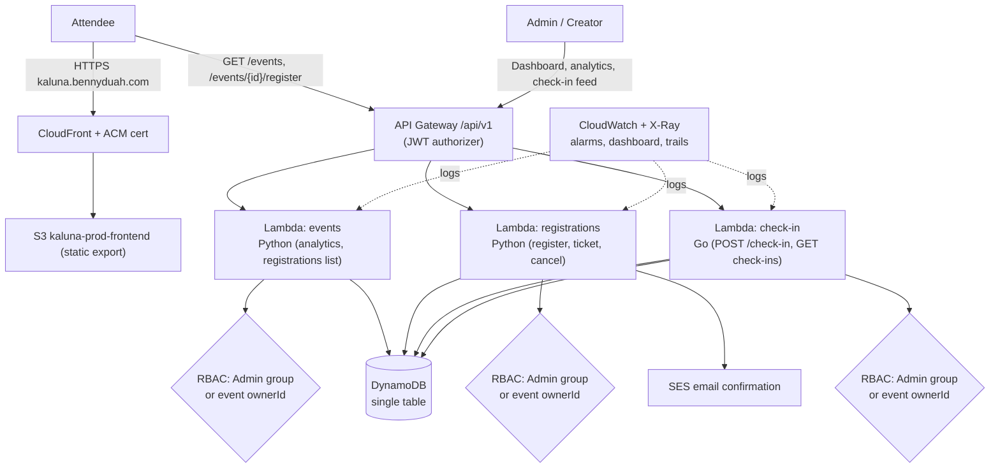

# Kaluna

A serverless event registration and ticketing platform on AWS — built to replace Microsoft Forms + Excel with a real API, QR-based check-in, and an admin dashboard with live capacity and attendance tracking.

Built as an Azubi Africa capstone, engineered like a small production system rather than a coursework assignment.

## Status

| Area | Built | Verified live |
|---|---|---|
| Check-in `POST /api/v1/check-in` 200 → 409 flow | ✅ | ✅ 2026-08-07 |
| RBAC: Creator blocked from other owners' registrations/check-ins | ✅ | ✅ 2026-08-07 |
| RBAC: Creator analytics scoped to own events | ✅ | ✅ 2026-08-07 |
| RBAC: Admin (Godmode) access preserved | ✅ | ✅ 2026-08-07 |
| Demo-data removed from frontend (no fabricated events/tickets) | ✅ | ✅ 2026-08-07 |
| Frontend hosted on S3 + CloudFront | ✅ | ✅ 2026-08-07 (`https://d2bgsq4d7iusgr.cloudfront.net/` → 200) |
| Custom domain `kaluna.bennyduah.com` | ✅ CloudFront + ACM cert ready | ⏳ DNS point at external registrar (see below) |
| 404 → SPA (S3/CloudFront error pages) | ✅ | ✅ |
| Terraform CI on push (`.github/workflows/deploy.yml`) | ✅ | ✅ tests+apply |

> Honest note: "Verified live" means proven against the deployed prod API/frontend with real HTTP requests, not just unit tests. Rows without a date are built but not yet live-verified.

### DNS (one manual step — no Route53 zone in this account)

- `apikaluna.bennyduah.com` → **CNAME** to API Gateway (`o275c5g9h5.execute-api.us-east-1.amazonaws.com`) — working.
- `kaluna.bennyduah.com` → currently an **A record at the external registrar** (resolves to Hostinger IPs). Point it to the CloudFront distribution:
  - **CNAME** `kaluna.bennyduah.com` → `d2bgsq4d7iusgr.cloudfront.net`
  - ACM cert for `kaluna.bennyduah.com` is ISSUED and attached to the distribution, so HTTPS works once DNS is switched.

## Stack

- **Architecture**: API Gateway → Lambda → DynamoDB, static frontend on S3/CloudFront
- **Compute**: AWS Lambda — Python (events, registrations), Go (check-in)
- **API**: Amazon API Gateway, `/api/v1`
- **Data**: DynamoDB, single-table design
- **Auth**: Amazon Cognito (Cognito groups: `Admin`, `Creator`)
- **Email**: Amazon SES
- **Infrastructure**: Terraform, modular, dev/staging/prod
- **CI/CD**: GitHub Actions
- **Observability**: CloudWatch + X-Ray

## Architecture



## RBAC model

- Roles come from Cognito groups in the ID token's `cognito:groups` claim (`Admin`, `Creator`).
- **Admin** (Godmode): platform-wide analytics, registrations/check-ins for any event.
- **Creator**: analytics scoped to events where `ownerId == sub`; registrations/check-ins for own events only. Attempts on other owners' events return `403 FORBIDDEN`; unknown events return `404`.
- Enforced in **both** the events service (`get_analytics`, `list_event_registrations`) and the check-in service (`handleGetCheckins`).

## Verification evidence

| Claim | Built where | Live check |
|---|---|---|
| Check-in 200 → 409 | `services/checkin/main.go` (Go), unit tests | `POST /events/{id}/register` → 201; `POST /check-in` → 200 `{"message":"Valid ticket, checked in"}`; repeat → 409; `GET /registrations/{ticketId}` → `"status": "checked_in"` |
| Creator blocked (registrations) | `services/events/app.py:417` | Creator token on admin event → **403** (was 200 pre-fix); Admin → 200 |
| Creator blocked (check-ins) | `services/checkin/main.go` `isAdminOrOwner` | Creator token on admin event → **403** (was 200 pre-fix); Admin → 200 |
| Creator analytics own-scope | `services/events/app.py` `get_analytics(ctx)` | Creator `/analytics` → own events only (0, since creator owns none); Admin → platform totals |
| No token → 401 | JWT authorizer | `GET /events/{id}/registrations` without token → **401** |
| Demo-data removed | `frontend/src/lib/api.ts`, `demo-data.ts` deleted | `npx tsc --noEmit` clean; `next build` clean |
| S3/CloudFront hosting | `terraform/modules/frontend/` | `GET https://d2bgsq4d7iusgr.cloudfront.net/` → 200; `/success/` → 200 |

Pre-fix security gaps (fixed & re-verified):
- `GET /analytics` with a Creator token returned **200** with platform-wide stats.
- `GET /events/{adminEventId}/registrations` with a Creator token returned **200** with attendee PII.
- `GET /events/{adminEventId}/check-ins` with a Creator token returned **200** with attendee data.

## Documentation

Start here: [`docs/00-engineering-spec.md`](docs/00-engineering-spec.md)

| Doc | Covers |
|---|---|
| [01-problem.md](docs/01-problem.md) | Why this exists |
| [02-requirements.md](docs/02-requirements.md) | Functional & non-functional requirements |
| [03-architecture.md](docs/03-architecture.md) | System design |
| [04-api.md](docs/04-api.md) | Endpoint reference (see also [`openapi.yaml`](openapi.yaml)) |
| [05-database.md](docs/05-database.md) | DynamoDB schema & access patterns |
| [06-security.md](docs/06-security.md) | IAM, auth, validation |
| [07-deployment.md](docs/07-deployment.md) | CI/CD pipeline |
| [08-monitoring.md](docs/08-monitoring.md) | Logging, alarms, tracing |
| [09-testing.md](docs/09-testing.md) | Test strategy |
| [10-cost-analysis.md](docs/10-cost-analysis.md) | AWS cost breakdown |
| [11-decisions.md](docs/11-decisions.md) | ADR index |
| [12-future-roadmap.md](docs/12-future-roadmap.md) | What's deliberately out of v1 |
| [13-final-status-report.md](docs/13-final-status-report.md) | Complete engineering report & Q&A presentation guide |

## Repository structure

```
terraform/       Infrastructure as code (modules + dev/staging/prod)
services/         Lambda source — events, registrations (Python), checkin (Go)
frontend/         Next.js App Router editorial frontend (static export)
docs/             Engineering spec, architecture, final report, ADRs
openapi.yaml      API contract
.github/workflows CI/CD pipeline
```

## Recent Changes

- **Check-in fix**: Resolved `POST /api/v1/check-in` 404 caused by `PayloadFormatVersion: 1.0` on the API Gateway integrations; updated to `2.0` in Terraform and verified live (200 → 409).
- **RBAC enforcement (security fix)**: Creator tokens no longer see platform-wide analytics, other owners' registrations, or other owners' check-ins — 403/404 returned.
- **Frontend cleanup (honesty fix)**: Removed the `demoStore` fallback layer in `frontend/src/lib/api.ts` and deleted `demo-data.ts`; the success page shows a real "Ticket Not Found" state instead of a fabricated ticket; `getTicket` maps `checked_in` → `used`.
- **Frontend hosting**: New `terraform/modules/frontend/` (S3 + OAC + CloudFront, ACM cert, 403/404 → SPA); live at `https://d2bgsq4d7iusgr.cloudfront.net/`.
- **Live check-in feed**: Dashboard fetches real attendees from `GET /api/v1/events/{eventId}/check-ins`.
- **Per-role analytics**: Creator tab scoped to own events; Admin (Godmode) shows platform totals.
- **Event delete**: Trash button calls `DELETE /api/v1/events/{id}` with confirmation.
- **Avatar stack**: `AvatarStack` wired to real `capacity - seatsRemaining` per event card.
- **Seed data**: 6 events seeded to `kaluna-prod-table` via `scripts/seed.py`.

## Quick Start (Deployment)

1. **Authenticate with AWS**: Ensure your AWS CLI is configured with an IAM user that has administrative privileges.
   ```bash
   aws configure
   ```
2. **Deploy via Terraform**:
   ```bash
   cd terraform/environments/dev
   terraform init
   terraform apply
   ```
3. **Verify Email**: AWS will send a verification link to your designated sender email (e.g., `contact@bennyduah.com`). Click it to allow Amazon SES to send ticket confirmations.
4. **Create Admin User**: Cognito public sign-ups are disabled. Create your admin account via CLI:
   ```bash
   aws cognito-idp admin-create-user --user-pool-id <YOUR_POOL_ID> --username contact@bennyduah.com
   ```
5. **Build & deploy frontend** (prod):
   ```bash
   cd frontend
   npm run build        # static export → out/
   aws s3 sync out/ s3://kaluna-prod-frontend --delete
   ```
6. **Test**: Hit `/api/v1/health` and `https://d2bgsq4d7iusgr.cloudfront.net/` to verify the system is live!
